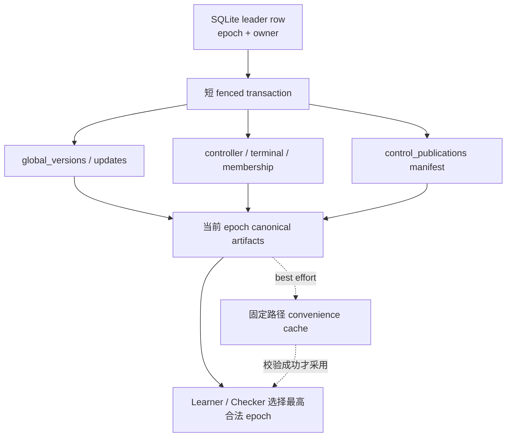
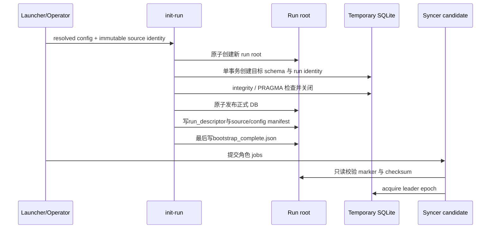
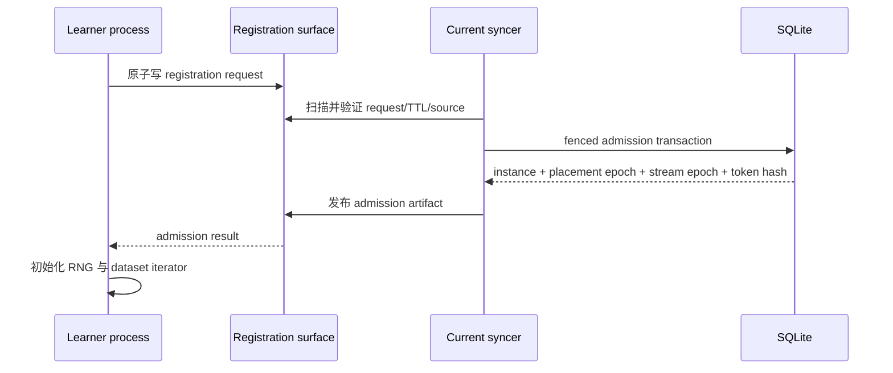
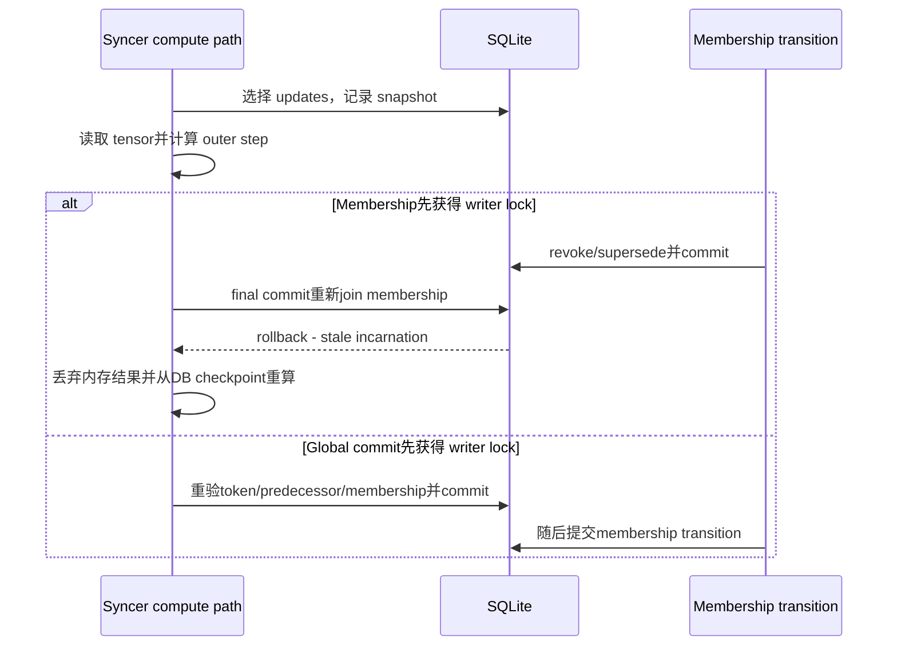
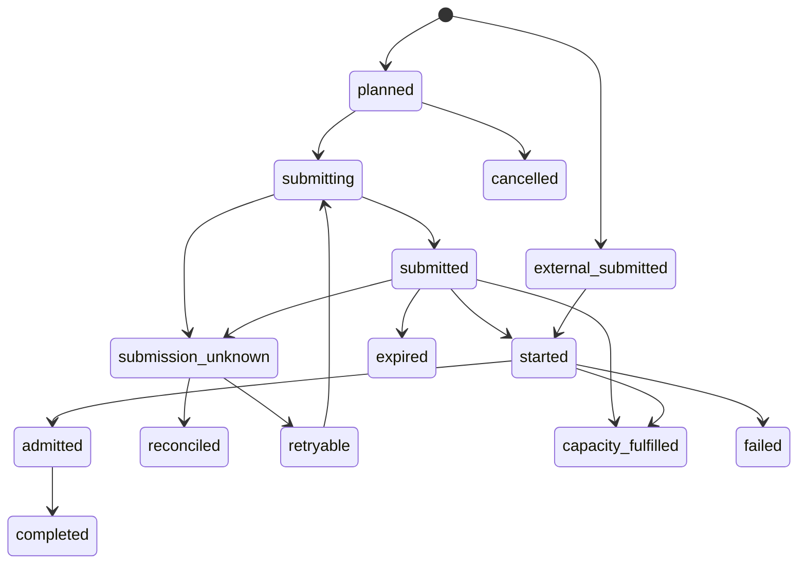
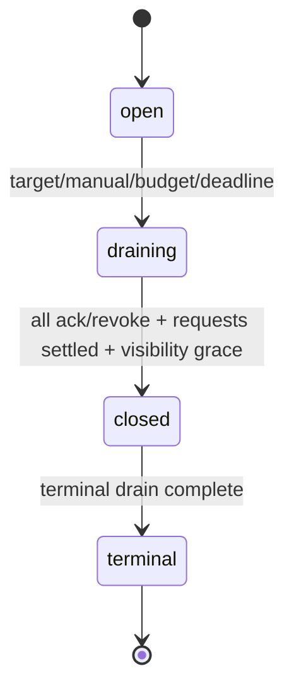

# 独立作业 Syncer HA 与动态 Learner 成员设计文档

文档状态：已综合两份审查完成设计修订，尚未实现或通过集群验收

对应计划：`plans/DOING/fsb_decoupled_diloco_plan_02.md`

对应审查：`reports/plan_review/20260805_fsb_decoupled_diloco_plan_02_review.md`

补充接触面审查：`reports/plan_review/20260805_plan02_review.md`

适用范围：filesystem-based Decoupled DiLoCo 的 full 模式

## 1. 文档目的

本文解释 Plan 02 修订后系统要如何工作、为什么采用这些边界，以及故障发生时人和程序应看到什么。实施计划负责列出 loop、gate、测试和交付物；本文负责让实现者、审查者和运维人员在不逐行阅读代码的情况下理解完整协议。

本文描述的是**待实现设计**，不是当前仓库已经具备的能力。所有 HA、动态成员和自动扩容结论都必须在对应 Checker 通过后才能写入用户文档的“已支持”部分。

### 1.1 审查问题与修订决策

| 审查项 | 修订后的设计决策 |
| --- | --- |
| P0-01 固定 cache 无法 fence 旧 writer | SQLite 保存 controller/terminal 权威；canonical artifact按 epoch隔离；固定 cache降级为可污染镜像。 |
| P0-02 writer transaction暂停阻塞takeover | 接受并测试 availability boundary；transaction保持短小；永久持锁需要授权终止旧 job。 |
| P0-03 dynamic terminal无法闭合 | 新增持久 drain generation、learner ack、timeout revoke、visibility grace和terminal merge上限。 |
| P0-04 单调 stream 与固定 shard API不兼容 | 改为 run内固定且有界的 virtual stream pool；replacement增加 stream epoch。 |
| P0-05 selection后membership竞态 | final global commit在同一transaction重新join instance、placement和stream。 |
| P1-01 claim可能产生qsub风暴 | observation key确定化，并加入scheduler reconciliation、uncertainty TTL、backoff和预算。 |
| P1-02 connect-time DDL破坏兼容性 | 新增独立一次性 init-run；candidate、learner和analysis均不得隐式建表或迁移。 |
| P1-03 takeover可能加载不同source/config | 初始化时固定immutable source与resolved config；PBS在import runtime前校验。 |
| P1-04 多syncer破坏单writer日志 | candidate、epoch log、CSV和W&B生命周期按owner/epoch隔离。 |
| P1-05 capacity window可被重放 | observation key设为唯一键；low counter与request creation在fenced transaction内更新。 |
| P1-06 stale registration可驱逐健康成员 | registration增加TTL和授权关系；健康placement默认拒绝普通replacement。 |
| P1-07 报告路径和requirement matrix缺失 | 报告目录改用完整计划ID，并新增45行FEAS/HA/MEM矩阵。 |
| P1-08 HA历史状态无界 | 定义live set、archive、GC和1000-cycle物理/逻辑有界性检查。 |
| P2 路线和统计口径不明确 | 自动能力默认关闭；Phase 0/1/2串行；冻结样本、分位数、matched baseline和文档同步条件。 |
| B3 初始learner会被unsolicited策略拒绝 | 保持unsolicited关闭；first leader创建确定性bootstrap requests，每个初始job携带bootstrap slot。 |
| B4 learner会创建全局目录 | 拆分authority与instance目录初始化；learner只能创建自己的identity目录。 |
| B5 旧watchdog会在PBS恢复期间杀死learner | watchdog改为最高epoch heartbeat、claim、scheduler与canonical repair感知，并设置独立recovery上限。 |
| B6 GC存在lease-check后暂停窗口 | 禁止目录差集直接删除；使用gc candidate ledger、grace与逐文件fenced重验。 |
| B7 epoch目录会让旧glob静默失效 | 推荐保留目录式隔离；所有扫描收敛到递归RunPaths iterator并断言非空。 |
| B8 dynamic ID破坏固定前缀与白名单 | ID采用`learner_li_<uuid4>`，但仍移除硬编码glob和固定learner白名单。 |
| B9 25个autocommit无法统一fence | 拆分Legacy/Fenced/ReadOnly store，并对31个现有写方法逐项迁移和验证。 |
| B10 connect-time DDL破坏pre-HA识别 | 使用init/open-existing/open-readonly三个入口，schema_meta与run_state双版本匹配。 |
| D1-D4 lease时序与format语义 | 定义candidate wait/poll、短busy timeout、leader monotonic lease和artifact-specific format version。 |
| D5-D11 stream、容量、TTL与quorum | 固定stream pool，冻结productive公式；queued job不因TTL释放reserved；dynamic quorum由pool约束。 |
| S1-S4 独立作业落地接触面 | job array优先、run descriptor交接、dynamic CLI显式化，并扩展现有shared-SQLite probe。 |

### 1.2 冲突方案的最终选择

两份审查对 checkpoint布局和dynamic ID给出了不同倾向。本文选择：

- **保留epoch目录，不改为单层长文件名。** 目录ownership更容易审查，也与“旧writer只能写自己的epoch空间”这一核心证明一致。所有受影响的glob、Checker和probe必须同步修复，不能为了少改几处代码削弱命名空间隔离；
- **使用`learner_li_`兼容前缀，但仍建立mode-aware iterator。** 前缀减少迁移风险，统一iterator则消除未来再次改名导致的静默空集；
- **初始成员使用bootstrap logical request，不打开unsolicited旁路。** 这样初始成员、扩容成员和replacement共享同一at-most-one admission模型；
- **legacy与HA store分离。** optional token看似改动较小，却会把“忘记传token”变成合法路径，因此不采用；
- **checkpoint SHA-256默认完全关闭。** 唯一路径、size、safetensors可读性和DB引用承担默认验证；只有显式checker或always模式才计算大文件digest，小型control JSON始终hash。

## 2. 背景与目标

当前 full 模式以 SQLite 作为 global version 与 update 状态的提交点，syncer 在共享文件系统上读取 learner proposal、计算 merge、写 checkpoint，再更新控制文件。现有设计适合一个 syncer 和固定 learner 集合，但不能直接支持以下场景：

- syncer 与 learner 作为互相独立的 PBS job 运行；
- syncer job 消失后由另一个进程从共享状态继续；
- learner 进程重启、替换或扩容而不复用含混的 learner ID；
- 训练结束时，不依赖初始化时写死的 learner 数完成输入闭合；
- 多个进程观察到故障或低容量时，不制造无界 qsub 风暴。

本设计的目标分为三层：

1. **Phase 0：证明基础原语的真实能力。** 先测 SQLite writer lock、共享时钟、固定 cache 的旧 writer 反例、PBS 查询能力和 source pinning；
2. **Phase 1：实现独立作业和 Syncer HA。** 以 SQLite epoch lease 选出唯一业务 writer，以 epoch-scoped 文件隔离旧进程；
3. **Phase 2：实现动态成员和有界扩容。** 将进程身份、物理位置和数据流分离，并用事务化 admission、launch outbox 和 drain ack 管理生命周期。

## 3. 明确不解决的问题

为了让协议可证明、可测试，本轮不承诺：

- fragment 模式的 HA、动态成员或 resume；
- scheduler 层物理 job 的 exactly-once 提交；
- 不终止永久持有 SQLite writer lock 的旧进程仍能自动接管；
- inner optimizer、dataset iterator offset 或 RNG 完整恢复；
- 主动缩容、自动删除健康 job；
- 依靠普通共享文件系统 `os.replace` 提供 fencing/CAS；
- 把自动 failover 或动态扩容包装成训练质量提升。

这些边界不是遗漏，而是当前“一个 SQLite + 普通共享文件系统 + PBS”原语下的显式产品契约。

## 4. 总体架构

### 4.1 权威状态与查询状态

系统采用三层状态：

| 层 | 内容 | 权威性 | 写入者 |
| --- | --- | --- | --- |
| SQLite | leader epoch、global version、update、controller、terminal、membership、launch request | 唯一业务权威 | 当前 leader 的 fenced transaction |
| 当前 epoch canonical artifact | learner 可读的 latest、drain、stop、summary、admission | DB 状态的可验证查询面 | 当前 epoch publisher |
| 固定路径 convenience cache | `control/latest.json`、`stop.json`、`summary.json` | 非权威，可被旧进程污染 | 当前或恢复后的旧 publisher 都可能写 |

数据流如下：



SQLite 决定“什么已经提交”；canonical artifact 让不打开 SQLite 的 learner 获得可验证视图；固定 cache 只减少正常路径上的扫描成本。

### 4.2 为什么固定 cache 不能成为权威

旧 leader 可以在完成 lease 检查后、执行 `os.replace` 前被暂停。新 leader 接管并发布后，旧进程恢复仍能替换相同固定路径。普通共享文件系统没有“只有 epoch N 才能替换”这一条件写原语。

因此本设计改变验收目标：

- 不再要求旧进程永远不能改变固定 cache 的 hash 或 mtime；
- 要求旧进程无法写入新 epoch 的 canonical 目录；
- reader 一旦观察到更高 epoch，永不因低 epoch cache 回退；
- Checker 可以报告 cache pollution，但不能把它误判为业务状态回滚。

每个 epoch 使用不同目录，即使旧进程恢复，它最多修改自己的旧目录和全局镜像。新 epoch 的路径名称由已经提交的 leader token决定，不与旧 writer 共享。

## 5. Phase 0：实施前可行性证明

Phase 0 的输出不是生产功能，而是五组可重复证据。

### 5.1 SQLite writer-lock 探针

进程 A 在共享 DB 上执行 `BEGIN IMMEDIATE`、写入但不提交，然后被暂停；进程 B 尝试 acquire。期望结果是：A 持锁期间 B 只能等待或 busy，A 被终止后 B 才能取得锁，而且 A 未提交的写不可见。

这个探针确认两个边界：

- transaction 外暂停可以在 lease 到期后接管；
- transaction 内永久暂停只能安全阻塞，不能自动接管。

### 5.2 旧 cache writer 探针

该探针要故意制造“旧 writer 覆盖固定 cache”，然后证明 reader 仍选择更高 epoch canonical artifact。反例必须稳定出现，否则无法证明测试真正命中了危险窗口。

### 5.3 时钟与共享 SQLite 探针

在至少两个计算节点测量 wall-clock skew、提交可见性、busy 行为、journal/synchronous 配置和 integrity。扩展现有 `sqlite_shared_fs_probe.py` 增加 `contend` 模式，记录N进程跨节点 acquire/renew争抢的busy次数、等待分布和starvation。lease使用可跨进程比较的wall clock；单进程内的“多久没前进”使用monotonic clock。

### 5.4 PBS 能力探针

验证计算节点能否调用 `qsub/qstat`、能可靠读取哪些状态、如何在Job Name或变量中携带request fingerprint，以及PBS job array是否可用。若自动提交能力不足，独立job与人工restart仍可继续，但自动recovery submission和scale-out保持关闭；array不可用时使用manifest列出的独立learner jobs。

### 5.5 Source/config pinning 探针

相同 source/config/run descriptor必须通过；commit、dirty fingerprint、resolved config或descriptor任一变化都必须在acquire/register前失败。失败进程只能写自己的candidate/learner日志，不能创建业务row。

## 6. Run 初始化与 schema 生命周期

### 6.1 为什么初始化必须独立

leader acquire 需要 `syncer_leader` 表，而创建该表又需要 schema 初始化。如果让“第一个 acquire 成功的 candidate”创建 schema，会形成先 acquire 还是先建 lease 表的循环依赖；若多个 candidate 都可自动 DDL，还会破坏 pre-HA fail-closed 和只读分析契约。

因此新增一次性的 `init-run` 步骤。它不是 syncer candidate，也不参加 leader 竞争。

### 6.2 初始化顺序



`bootstrap_complete.json` 是“允许角色启动”的门，不是业务 authority。它固定schema、protocol、source、config和DB identity，但不记录会随业务提交变化的整个DB文件hash。`run_descriptor.json`提供独立作业交接协议：job只需从环境获得shared root，再读取run ID、resolved config、source identity、mode和bootstrap slot数量。candidate/learner只有在marker、descriptor与DB完全一致时才继续。

若初始化中途崩溃，run root会保持incomplete；角色必须fail closed。只有显式operator恢复可以处理incomplete root，且仅当source/config完全一致、没有业务row时才允许继续。live run启动后不做在线schema迁移。

SQLite打开API分成三条：`initialize_new_run()`是唯一DDL入口，`open_existing(expected_identity)`只打开完成bootstrap的DB，`open_readonly()`使用`mode=ro`供analysis/Checker使用。initializer在同一transaction写`schema_meta.schema_version`和`run_state['schema_version']`，两者与marker必须一致；不能通过“某张表碰巧存在”识别HA schema。

JSON格式不全局提升现有`FORMAT_VERSION`。syncer heartbeat、epoch control和membership artifact分别使用自己的版本常量并从1开始，避免新文件类型迫使历史heartbeat、parameter index或update metadata全部升级。

### 6.3 兼容策略

| 现有状态 | HA 关闭 | HA 开启 |
| --- | --- | --- |
| legacy full | 保持现有单 syncer 路径 | 不在线迁移，fail closed |
| HA full | 可按已解析模式打开 | 按 schema/protocol 精确匹配打开 |
| legacy fragment | 保持现有静态路径 | fail closed |
| dynamic full | 不允许降级为 legacy writer | 必须同时满足 HA 与 dynamic schema |

analysis和Checker使用SQLite read-only URI，禁止因打开历史run触发DDL或`ALTER TABLE`。legacy full/fragment由`LegacySQLiteStore`打开；HA full/dynamic由`FencedSQLiteStore`打开，不使用optional token混合两种语义。

## 7. Source、配置与进程输出隔离

长期作业不能从持续变化的主工作树加载代码。每个正式 run 固定：

- immutable source root 或 clean commit worktree；
- source fingerprint、commit、dirty 状态与入口；
- 完整 resolved config 及 checksum；
- schema/protocol/JSON format version；
- Python 与依赖环境摘要。

PBS wrapper 在 import `fs_diloco` 之前比较 expected 和 actual identity。不匹配时退出，避免“旧 learner + 新 syncer”或“新 candidate 接管旧 DB”的混合协议。

目录初始化也按角色拆分。`init-run`调用`prepare_authority_dirs()`创建control、weights、optim等全局命名空间；learner只能调用`prepare_instance_dirs(instance_id)`创建自己的heartbeat、pointer、payload和log路径。当前会由learner调用并预建所有成员目录的`prepare_run_dirs()`不得进入新协议。

多 candidate 也不能共写当前单一日志。输出按角色和 epoch隔离：

```text
logs/candidates/<owner>.jsonl
logs/syncers/e000007_<owner-short>.jsonl
metrics/syncer_epochs/e000007_<owner-short>.csv
```

W&B 只在 acquire、identity校验和 resume全部成功后初始化。loser candidate不创建业务 run；最终汇总根据 DB epoch history选择合法记录。

## 8. Phase 1：Leader lease 与 fencing

### 8.1 Leader token

每次 acquire 产生不可变 token：

```text
LeaderToken(run_id, epoch, owner_id)
```

epoch 对同一 run 单调递增且永不复用；owner ID包含 job、本机、PID和随机 UUID，用于区分同一 job或节点上的不同进程。

### 8.2 Acquire 与 renew

Acquire 在 `BEGIN IMMEDIATE` 中完成：

1. 读取 singleton leader row；
2. 无 owner时创建 epoch 1；
3. released时创建下一 epoch；
4. active时只有超过 `lease_expires_at + max_clock_skew` 才能接管；
5. 同时写 epoch history和新的 singleton row；
6. commit后 token才生效。

renew使用独立短超时connection，必须精确匹配epoch/owner，且busy timeout不超过renew interval。leader每次成功renew记录monotonic时间，自身剩余租约只由monotonic elapsed计算；DB wall-clock expiry只供其他节点判断takeover。lease已过期的owner不能通过late renew原地复活，只能作为新candidate参与下一epoch。

candidate先只读观察heartbeat，只在疑似expiry时按带jitter的poll间隔尝试acquire，并在`candidate_wait_seconds`后退出。健康leader存在时，candidate不应周期性取得SQLite writer lock。

### 8.3 业务 transaction 的 fence

每个业务写操作必须通过 fenced store：

```text
BEGIN IMMEDIATE
  -> 校验 leader token
  -> 校验 lease 尚可开始新 transaction
  -> 执行短 DB 写
  -> commit 前再次校验 token
COMMIT
```

transaction 内禁止文件 I/O、checkpoint、模型计算、qstat/qsub、sleep 和长 checksum。原始 writable connection或通用 `execute()` 不能暴露给生产调用方，否则 fencing 可以被绕过。

SQLite writer lock同时提供线性顺序：若旧业务 transaction先获得 lock，它必须先 commit/rollback，successor acquire才能开始；若 successor acquire先 commit，旧 token在下一 transaction校验时必然失败。

当前store有31个写方法，其中只有6个已有显式`BEGIN IMMEDIATE`。实现不能只修改global commit，而要建立逐方法inventory，记录owner store、transaction边界、token要求、调用点和RED test。HA full的所有写方法进入`FencedSQLiteStore`；static full和fragment留在`LegacySQLiteStore`并做逐字节回归；analysis进入`ReadOnlySQLiteStore`。optional token或no-op token不被允许，因为它会把漏传fence变成合法代码路径。

### 8.4 可用性边界

| 旧 leader 状态 | 新 candidate 行为 | 安全性 | 自动可用性 |
| --- | --- | --- | --- |
| transaction 外暂停 | lease 到期后 acquire新 epoch | 保持 | 可接管 |
| transaction 内短暂停 | 等待旧 transaction释放 | 保持 | 延迟接管 |
| transaction 内永久暂停 | 持续 busy/等待 | 保持，不产生双 writer | 不保证；需授权终止旧 job |
| 旧 leader恢复但新 epoch已提交 | 所有新业务 transaction fence失败 | 保持 | 新 leader继续 |

系统不存在自动`qdel`配置。出现永久writer lock时，Checker应报告明确blocker和对应job identity，由operator执行带审计的终止决定。

## 9. Checkpoint 与控制面发布协议

### 9.1 路径设计

```text
weights/epochs/e000007/<owner-short>/global_v000018_p<publication-short>.safetensors
optim/epochs/e000007/<owner-short>/outer_v000018_p<publication-short>.safetensors

control/syncer_epochs/e000007_<owner-short>/
  heartbeat.json
  latest/head.json
  latest/v000018.json
  terminal/drain_g000001.json
  terminal/stop_g000001.json
  terminal/summary_g000001.json
```

binary与`vNNN/stop_gNNN/summary_gNNN`是不可变对象。binary路径包含随机publication ID，目标已存在直接fail closed；DB必存size，checkpoint SHA-256默认不计算。小型control artifact始终保存SHA-256。`head.json`只在自己的epoch目录内原子替换。

checkpoint digest有三个显式模式：

| 模式 | Publisher | Completed Checker | DB checkpoint digest |
| --- | --- | --- | --- |
| `off`（默认） | 不计算 | 不计算 | `NULL` |
| `checker` | 不计算 | 离线计算并仅写report | `NULL` |
| `always` | commit前计算 | 校验已记录digest | 非空 |

`off`模式仍检查DB path、publication ID、记录size与实际size、safetensors header/loadability和引用一致性。它不提供内容级bit-rot检测；这是基于“已fsync文件不会被底层静默破坏”的既有故障模型做出的性能选择。proposal payload的既有`io.compute_sha256`不受影响。

保留目录式布局是有意选择。为避免现有非递归glob静默返回空，`RunPaths`提供mode-aware递归iterator，统一供maintenance、Plan 01 Checker、publication crash probe、liveness、analysis和metrics使用。测试不仅比较结果，还要断言本应存在对象的扫描计数大于零。

### 9.2 发布与恢复顺序

一次 global merge 的正确顺序是：

1. 在 transaction 外计算新权重和 outer state；
2. 写带publication ID的epoch唯一binary并fsync，记录size；`always`模式才在关键路径计算SHA-256；
3. fenced transaction重新验证 predecessor、leader token和 selected updates；
4. transaction提交global version、update状态、binary路径、size和可选checksum；
5. 写当前 epoch不可变 `latest/vNNN.json`；
6. 写或更新 publication manifest；
7. 原子更新当前 epoch `head.json`；
8. best-effort更新固定 `control/latest.json`。

若在第2步后崩溃，binary是orphan；若在第4步后崩溃，new leader从DB row和checkpoint重建canonical artifact；固定cache缺失或错误不妨碍恢复。

### 9.3 Learner 的 epoch选择

learner不打开业务 SQLite。它扫描有界的 epoch查询面，选择最高合法 epoch，并维护四个不可回退水位：epoch、owner、global version和terminal generation。

固定 cache只有在 publisher与当前最高 epoch匹配、版本不回退、checksum正确时才作为快速路径。一旦看到 epoch 8，epoch 7恢复后写出的任何 cache都不能让 reader回到 epoch 7。

learner watchdog不再把“global version没有前进”直接等同于syncer死亡。它观察最高合法epoch heartbeat seq的本地monotonic进展，并识别有效claim、queued/prologue/running candidate和canonical repair窗口。只要heartbeat有效，no-progress不会触发`syncer_unresponsive`；恢复作业仍在配置上限内排队时learner继续等待。固定`stop.json`只有通过current epoch/owner/generation/hash校验才生效。

若learner已经看到更高epoch但canonical head尚未发布，它按`canonical_repair_wait_seconds`周期告警和重扫；超窗不接受旧cache，也不立即退出。只有recovery总上限耗尽且没有合法leader/candidate时，才以明确的`syncer_recovery_exhausted`原因受控停止。

### 9.4 有界保留

live set包括current epoch、DB当前checkpoint、仍可能恢复的旧job目录、未过retention的claim和少量recent audit记录。旧job只有在scheduler确认结束或明确超过安全保留条件后才能解除引用。历史写入append-only archive，但archive不参与正常discovery。

GC禁止“扫描目录减去DB引用后直接unlink”。orphan先进入`gc_candidates`，或由reconciler在`lease_duration + max_clock_skew`后登记；一旦登记为orphan，该publication path永远不得再被业务transaction引用。删除worker在每个unlink前用短fenced transaction重新验证token、grace和全部DB引用。若旧leader在检查后暂停，新epoch也只会使用不同epoch/publication ID，因此目标不会变成新leader的current文件。故障测试必须把暂停点放在GC循环内部，并同时证明current文件未变与预期orphan确实被删除。

## 10. Recovery submission

自动提交默认关闭。启用后，它只是“产生 candidate”的机制，不授予 leadership。

所有 learner根据同一个 `(run_id, highest_epoch, heartbeat_seq, heartbeat_fingerprint)` 得到 observation key，并竞争共享 attempt目录。每次 attempt前必须：

- reconcile现有 receipt与 scheduler状态；
- 等待 claim timeout、uncertainty timeout与指数 backoff；
- 确认没有queued/prologue/running outstanding candidate；scheduler仍确认存在的job不因wall-clock TTL释放；
- 确认没有合法 terminal generation；
- 检查每 observation尝试上限和全局资源预算。

qsub成功但 receipt写入前崩溃时，物理 duplicate仍可能产生。leader lease吸收多余 candidate；资源预算限制重复规模。设计只保证 logical request 最多一个 actor获得业务 authority，不保证 PBS只创建一个物理 job。

## 11. Phase 2 身份模型

动态成员必须分开三个概念：

| 身份 | 含义 | 生命周期 |
| --- | --- | --- |
| `learner_instance_id` | 一次进程启动 | 每次重启新建 |
| `placement_id/placement_epoch` | 某 host/GPU位置及其代际 | replacement时递增 |
| `stream_id/stream_epoch` | 数据 shard/RNG虚拟流及其代际 | pool固定，重新分配时epoch递增 |

过去把 learner ID 同时用于目录、成员身份和数据 shard，在动态环境中会产生冲突。新模型允许同一位置上的新进程与旧进程明确区分，也允许 stream 被安全复用而不接受旧 proposal。

dynamic instance ID使用`learner_li_<uuid4>`，复用现有learner前缀以降低迁移风险，但validator不再用`valid_learner_ids(num_learners)`白名单。path ownership、UUID格式、admission row和token共同决定合法性；所有扫描经`RunPaths` iterator完成。

CLI按模式区分：static仍要求`--learner-id`；dynamic拒绝该参数并自行生成instance ID，只接受`--bootstrap-slot`或`--launch-request-id`作为admission授权。dynamic也拒绝显式`--num-learners`作为成员权威，数据分片兼容值由`stream_pool_size`派生。

### 11.1 固定 virtual stream pool

`stream_pool_size` 在 run初始化后不可变，stream ID限定为 `[0, stream_pool_size)`：

```text
learner_index = stream_id
num_learners = stream_pool_size
seed = training.seed + deterministic(stream_id)
```

这样满足当前 Hugging Face dataset shard API 的 `index < num_shards` 约束，也避免 active learner数变化时重定义所有 shard。

replacement复用同一 stream时增加 `stream_epoch`。本轮不保存 iterator offset，因此新实例从该 stream确定性序列起点重新开始，并记录 `stream_restarted=true`。这会导致可能的数据重复，属于报告中必须披露的限制，不能解释为 exact data replay。

同时满足`quorum_min <= desired_contributors <= quorum_max <= stream_pool_size`。`max_active_instance_records`只是current加grace的存储上限；current admitted实例总数仍不能超过stream pool。

## 12. Registration、admission 与 replacement

`allow_unsolicited_registration=false`保持默认，初始成员也不绕过它。first leader完成v0后按`bootstrap_instances`创建确定性logical requests：

```text
request_id = sha256(run_id, "bootstrap", slot, config_fingerprint)
bootstrap_slot = 0..bootstrap_instances-1
reason = bootstrap
state = external_submitted
```

然后发布`bootstrap_ready_g000001.json`。PBS job array优先为每个初始learner提供唯一slot；array不可用时，operator按run descriptor中的manifest提交独立job。learner可以先进入等待态，但在ready artifact出现前不能注册或初始化dataset。一个slot最多admit一个instance，第9个无request注册不会因为“它是初始作业”而获得例外。

bootstrap与scale-out request共用admission唯一性和scheduler审计，但bootstrap不消耗scale request总预算或cooldown；它仍计入current/reserved capacity上限。

learner必须先 admission、后创建 data iterator：



Admission transaction必须是幂等的。相同request重放返回相同结果；过期request、source不匹配、已fulfilled launch request的duplicate job都被拒绝。scale-out job到达时还要在transaction内重新计算current/reserved capacity；若另一个request已经满足desired或pool上限，late request转为`capacity_fulfilled`，不能因旧scheduler观测过期而形成跨request超发。

普通 duplicate不能驱逐健康 placement。只有三种情况可以 replacement：

1. current instance已经被明确标记 dead/revoked/expired；
2. request带 leader创建的 authorized replacement generation；
3. operator以显式授权发起 replacement。

heartbeat stale只是一条观测，不自动让旧 proposal失效；leader必须提交明确的 membership transition，之后才允许 stream复用。

## 13. Proposal 与最终 commit fence

proposal携带：instance、placement epoch、stream epoch、admission generation和token hash。摄取校验只能拒绝当时已知的 stale proposal，不能覆盖“selected 后才发生 replacement”的竞态。

因此 final global commit transaction再次 join membership：



可接受结果只有两个：旧成员的 global commit完整先发生，或 membership变更先发生并使 global commit回滚。不存在“membership已经撤销，但旧计算仍悄悄提交”的第三种状态。

## 14. Capacity observation 与 launch outbox

### 14.1 幂等 observation

merge observation使用 `merge:<committed_global_version>`；无 merge 的 starvation observation由 DB controller分配持久 generation。相同 observation key只能插入一行，且 low counter与该行在同一个 fenced transaction更新。

`productive_instances`只计算current admitted instance，并满足以下任一条件：最近`productive_window_count`个唯一observation贡献过；仍在startup grace；或heartbeat fresh且`now-last_proposal_at <= clamp(last_cycle_step_time_mean * inner_steps * factor, min, max)`。遥测缺失时只能使用有界startup grace，不能让实例永久被视为productive。

连续 low 的含义是连续多个**不同** observation key都 low；replay或takeover重复处理同一 key不会推进计数。

DB只保留最近配置数量的processed observations。更旧row先fsync归档再由fenced GC删除；low counter和productive window使用持久摘要，不每轮扫描完整历史。

### 14.2 Scale-out 条件

创建 request必须同时满足：

- bootstrap requests已经全部admitted/terminal，或initial membership deadline已过且scheduler reconciliation完成；
- 最近 N 个唯一 observation都 low；
- productive + reserved 小于 desired；
- admission仍 open且有空闲 stream；
- pending、cooldown、每 observation和总 request预算均未超限；
- current admitted + scheduler-confirmed reserved不超过stream pool。

request ID由 run、observation、ordinal和config fingerprint确定，因此重放得到同一个 logical request。

### 14.3 Outbox 状态机



TTL只约束尚无scheduler确认的planned/submission_unknown授权。一旦qstat确认job queued/prologue/running，它无论等待多久都持续计reserved capacity，直到scheduler确认terminal或absent并完成reconciliation；不能先释放A的容量再创建B，随后A/B同时启动造成跨request超发。即使crash窗口制造两个物理job，admission transaction也只允许一个instance关联并完成该logical request，其余job被拒绝。

### 14.4 独立作业编排

正式流程是：operator运行init-run；提交一个syncer candidate job；first leader完成v0并创建bootstrap requests；再提交带slot的learner job array。若Phase 0证明array不可用，则launcher读取run descriptor生成等价的独立job manifest。所有job从同一immutable source和resolved config启动。

初始成员尚在queued/running时计reserved，initial membership deadline前禁止因“贡献者不足”自动扩容。9节点验收的峰值是1 syncer + 8 learner：先达到该稳定态，再永久终止一个learner并由scheduler确认其job结束，之后才创建replacement恢复到1+8；不会让旧job和replacement同时占用第10个节点。

## 15. Dynamic close 与 drain acknowledgement

动态成员不能通过“等待所有初始化 learner ID出现 stop”闭合。controller使用持久状态机：



进入 `draining(close_generation)` 的同一 transaction完成：

- 关闭新 launch和新 admission；
- 取消尚未 admission 的 logical request；
- 冻结 `max_terminal_version`；
- 发布 current epoch `drain_gNNN.json`。

target-driven close的上限是 global target；其他 close原因的上限是 `min(global_target, current_version + max_terminal_merges)`。这防止“每个 learner一份 final proposal”使训练无界超过目标。final proposal只表示“这是该实例最后可见的候选”，不保证一定被 merge；超过上限或不满足 eligibility的 proposal记为 `stopped_unconsumed`。

每个 current learner观察到 drain generation后，完成已经开始的本地 cycle，最多原子发布一份 final proposal，然后写可重放 ack：

```text
status = drained
close_generation = N
final_update_id = <id-or-null>
```

未响应 learner到 timeout后由 leader显式 revoke。takeover从 DB读取同一 close generation和terminal上限，不创建新的 generation，也不重新打开 admission。

只有以下条件全部成立才是 `input_closed`：

- admission state已经 closed；
- 每个 current instance都 drained、stopped或revoked；
- 没有 launch request还能 admission；
- 没有未过期 registration request；
- final pointer已经完成摄取；
- registration/proposal visibility grace已经结束。

随后 syncer在 `max_terminal_version` 内完成严格 terminal drain，提交 DB terminal row，再发布当前 epoch stop/summary。尾部不会降低 future、stale、incarnation或stream fence。

## 16. 故障行为总表

| 故障 | 权威结果 | 自动动作 | 人工动作 |
| --- | --- | --- | --- |
| syncer在 transaction 外停止 | lease到期后新 epoch可提交 | candidate接管并从 DB恢复 | 无 |
| syncer在 writer transaction内永久暂停 | DB无双 writer，但接管被锁阻塞 | 报告 blocker，不自动 qdel | 授权终止旧 job |
| DB commit后、canonical publish前崩溃 | DB version有效 | 新 leader重建 artifact | 无 |
| binary写完、DB commit前崩溃 | binary orphan，无业务提交 | grace后登记gc candidate并逐项fenced删除 | live删除仍遵守授权规则 |
| 旧 epoch恢复写固定 cache | cache可能污染，DB/current canonical不变 | reader忽略，current leader可修复 | 无 |
| 旧epoch在GC循环中恢复 | 目标只能是冻结的旧publication；current DB引用不变 | 每项重验token失败后中止 | 无 |
| syncer恢复job长时间排队 | learner保持epoch/recovery-aware等待 | scheduler确认存在时持续等待到独立上限 | 超上限后检查队列/作业 |
| qsub成功、receipt前崩溃 | scheduler可能已有 job | reconcile后决定等待或重试 | scheduler不可查询时可能需检查 |
| duplicate learner registration | 健康 current不被驱逐 | duplicate被拒绝 | 授权replacement例外 |
| bootstrap slot重复或超预算 | 已admit实例不变 | duplicate/无request registration被拒绝 | 修正launcher slot |
| queued learner超过request TTL | reserved容量不释放 | 持续reconcile，禁止跨request补提 | scheduler长期unknown时检查 |
| selection后成员被revoke | commit-time join失败 | 回滚并从DB checkpoint重算 | 无 |
| draining时 learner不响应 | input不能直接闭合 | timeout后显式 revoke | 可检查节点/job原因 |
| source/config mismatch | 不产生业务 row | fail closed并记录独立日志 | 修正提交源或创建新 run |

## 17. 有界状态与垃圾回收

正确性不仅要求逻辑行数有界，也要求 SQLite物理 pages和文件 discovery面有界。

正常扫描只覆盖：

- current/recent leader epoch和仍可能恢复的旧 job；
- current/grace instance；
- unresolved registration与nonterminal launch request；
- 每个 current instance一个 proposal pointer；
- 有限 recent capacity observations。

历史行在解除所有DB/FS引用后写入fsync过的JSONL archive，再从active表和discovery目录删除。checkpoint由DB引用和gc ledger决定live set，不能只根据文件名或mtime清理。capacity observation只保留配置数量的recent rows；queued/running request在scheduler确认终态前仍属于active set。

所有文件发现使用共享的RunPaths递归iterator。兼容前缀`learner_li_`只是迁移辅助，不允许liveness、maintenance、analysis或metrics各自维护glob。测试必须同时检查expected count与observed count，避免“扫描为空所以没有发现错误”的假通过。

1000 takeover/claim和1000 membership churn测试要同时测：active row数、目录/文件数、SQLite `page_count/freelist_count`、单轮扫描条目和耗时。append-only archive允许增长，但不允许正常运行每轮扫描整个 archive。

## 18. 配置与安全默认值

所有新增行为默认关闭：

```yaml
coordination:
  syncer_ha:
    enabled: false
  recovery_submission:
    enabled: false

membership:
  mode: static
  stream_pool_size: 8
  bootstrap_instances: 8

scaling:
  enabled: false
```

dynamic要求full + HA；fragment + HA/dynamic直接报错，并满足`quorum_min <= desired <= quorum_max <= stream_pool_size`。正式启用自动qsub或scale-out需要显式授权；`qdel`不属于配置开关，只能由operator单独授权并记录。

计划中的 90秒 lease、10秒 renew等时间是 Phase 0 probe起点，不是先验安全结论。最终值必须满足配置约束，并以共享文件系统和PBS实测分布为依据。

## 19. 实施结构

建议代码边界如下：

| 模块 | 责任 |
| --- | --- |
| `storage/schema_bootstrap.py` | schema分类、只读识别、init-run目标schema创建 |
| `storage/leader_lease.py` | acquire、renew、release、epoch history |
| `storage/sqlite_store.py` | LegacySQLiteStore和只读query基础；保留static/fragment基线 |
| `storage/fenced_store.py` | FencedSQLiteStore、所有HA业务transaction与token校验 |
| `storage/paths.py` | authority/instance目录拆分和mode-aware递归iterator |
| `storage/maintenance.py` | gc candidate ledger、grace和逐项fenced deletion |
| `protocol/control_epoch.py` | epoch artifact、manifest、reader选择与cache修复 |
| `protocol/liveness.py` | dynamic identity validator和epoch-aware heartbeat discovery |
| `protocol/membership.py` | registration、admission、replacement、stream分配 |
| `protocol/dynamic_terminal.py` | drain generation、ack、input_closed与terminal预算 |
| `runtime/launch_outbox.py` | logical request、qsub、receipt、reconciliation |
| `runtime/pbs_scheduler.py` | scheduler查询规范化，不承载业务authority |
| `tools/init_run.py` | 一次性run初始化、run descriptor和bootstrap complete marker |
| `tools/launch_independent_run.py` | 生成job array或独立job manifest；默认dry-run，显式提交syncer与bootstrap slots |
| `scripts/miyabi/sqlite_shared_fs_probe.py` | 新增contend模式，复用现有跨节点探针 |
| Plan 01 Checker与publication probe | 迁移到递归RunPaths iterator并加入非空断言 |

核心原则是：lease store不给 candidate业务 mutator；fenced store不执行文件I/O；scheduler层不决定 leadership；analysis使用只读接口。

## 20. 验证与发布判定

验证必须按 Phase 0 → Phase 1 → Phase 2 串行推进。

Phase 1至少证明：

- init/open-existing/open-readonly不会静默迁移历史DB，schema双版本一致；
- 当前31个写方法全部有明确store、transaction和test归属；
- 并发 acquire只有一个epoch winner；
- successor提交后旧 token无法写业务DB；
- transaction外暂停可接管、transaction内暂停按明确边界处理；
- 旧 writer可污染固定 cache但不能影响 current canonical选择；
- DB commit/control publish窗口可恢复；
- directory epoch下maintenance、Checker、probe、liveness和analysis扫描实际非空；
- old leader在GC循环中恢复不能删除current文件，且orphan GC不是no-op；
- recovery claim/PBS排队超过旧watchdog上限时learner不被误杀；
- source mismatch和pre-HA/fragment HA均 fail closed；
- 1000次 synthetic恢复后 active状态有界；
- 2节点真实shared-FS和9节点独立PBS job验收通过。

Phase 2还要证明：

- stream pool与当前dataset API一致且1000次churn不越界；
- bootstrap slots在unsolicited关闭时启动初始成员且超预算拒绝；
- stale/duplicate registration不能驱逐健康成员；
- selected后membership竞态只能产生两种线性化结果；
- observation replay不推进low counter；
- logical launch request最多一个admitted instance；
- queued/running request超过TTL仍reserved，admitted+reserved不超过stream pool；
- 健康 learner可通过drain ack闭合，未响应者按timeout revoke；
- 9节点场景覆盖死亡、暂停、scale-out、duplicate physical job和terminal closure。

Checker stdout只有 `PASS`、`PASS_WITH_FOLLOWUPS` 或 `BLOCKED`。Phase 2不能使用 staged pass；缺少核心 evidence必须是 `BLOCKED`。

## 21. 已知限制与后续演进

本设计选择安全性优先于 writer-lock永久暂停时的自动可用性；若未来必须在该故障下无人工介入接管，需要外部 fencing/consensus或能强制撤销旧 writer存储访问的基础设施，不能只修改 lease timeout。

固定 stream pool避免动态 shard定义漂移，但限制同一时刻的最大贡献者数。改变 pool大小应创建新 run，而不是在线扩容。iterator offset未恢复会产生可观测的数据重放，应作为后续独立研究与实现问题。

自动 recovery和scale-out默认关闭，即使协议实现完成，也应先以人工独立job restart通过真实集群验收，再逐项开启自动化。最终是否把这些能力提升为项目默认路线，还需同步 `plans/00-RESEARCH_PLAN.md` 的范围和优先级决策。
